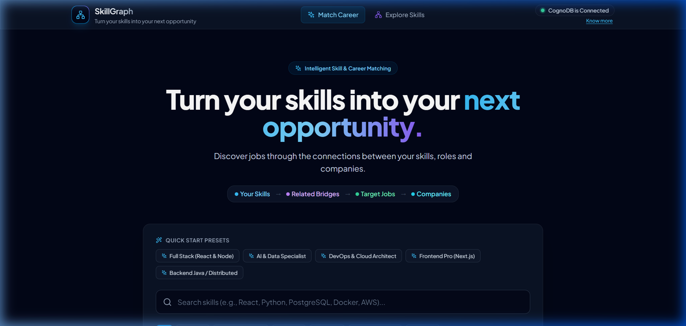
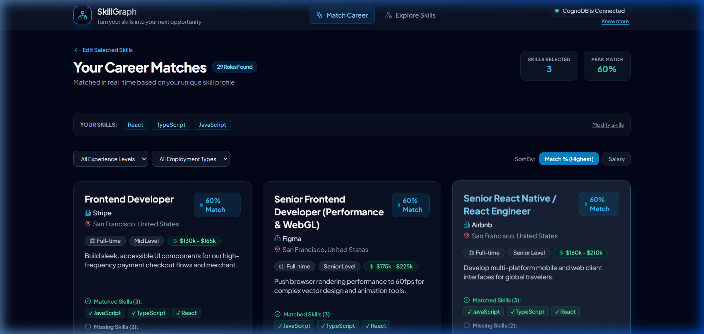
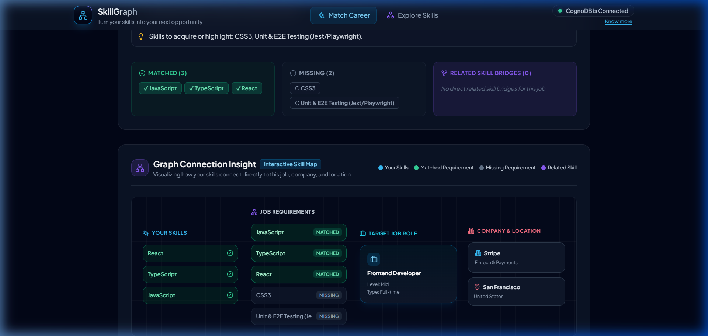
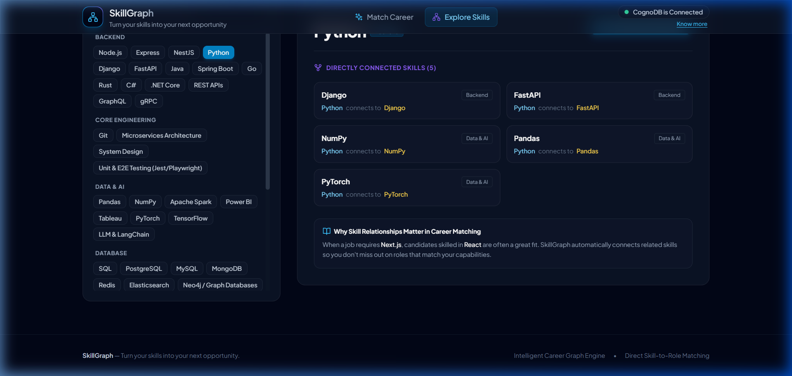
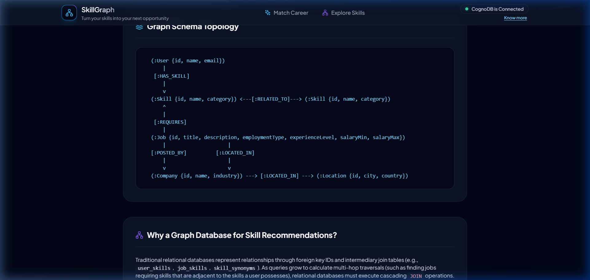
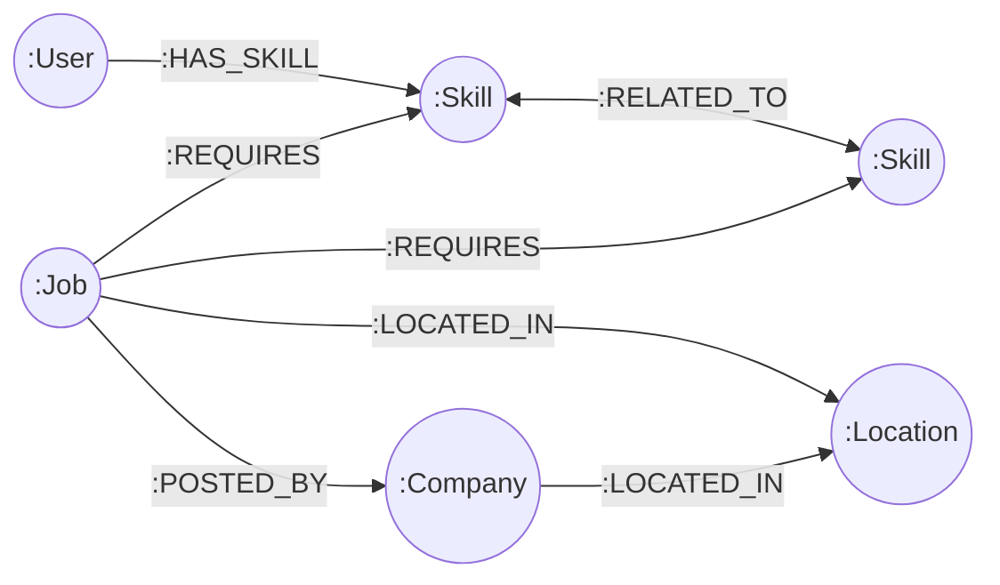

# 🌐 SkillGraph — Graph-Powered Career & Skill Recommendation Platform

> **"Turn your skills into your next opportunity."**

SkillGraph is a high-performance, graph-native career intelligence and job recommendation platform. Powered by **CognoDB Cloud** (via openCypher & the official Neo4j Bolt protocol), an **Express + TypeScript** backend, and a modern **React + Vite + Tailwind CSS** frontend, SkillGraph navigates deep, multi-hop relationships between candidates, skills, roles, companies, and locations in real-time.

---

## 📸 User Interface Preview

| 1. Skill Selector & Quick-Start Presets | 2. Real-Time Career Matches |
| :---: | :---: |
|  |  |

| 3. Interactive Graph Connection Insight | 4. Skill Knowledge Graph Explorer |
| :---: | :---: |
|  |  |

| 5. Under the Hood: Graph Architecture & Schema |
| :---: |
|  |

---

## 🎯 Use Case & Problem Statement

### The Problem
Traditional recruitment platforms rely on rigid keyword searches and flat relational database tables:
* **The Synonym/Adjacent Gap**: If a job description requests `Next.js` and a candidate has `React`, keyword systems score this as a 0% match.
* **Black-Box Suggestions**: Candidates receive job recommendations without understanding *why* they were suggested or which skills triggered the match.
* **Relational JOIN Explosion**: Calculating multi-hop relationships (e.g., candidate skills → related skill bridges → role requirements → hiring companies) in SQL requires 5 to 7 cascading `JOIN` and `LEFT OUTER JOIN` operations that degrade exponentially at scale.

### The SkillGraph Solution
SkillGraph treats the employment ecosystem as a **first-class Property Graph**:
1. **Direct Match Computation**: Calculates authentic mathematical skill-match percentages directly inside the graph engine.
2. **Multi-Hop Skill Bridges**: Automatically identifies adjacent technical competencies via `[:RELATED_TO]` edges (e.g., `React` bridges to `Next.js` and `Redux`).
3. **Transparent Reasoning**: Delivers clear "Why This Match?" explanations derived from graph path facts.
4. **Interactive Graph Topology**: Renders intuitive visual connection maps linking the candidate's skills to the job, company, and location.

---

## 💡 Why a Graph Database for Skill Recommendations?

In a relational database (RDBMS), connecting candidates to jobs through skills requires navigating through multiple intermediary join tables:
* `users` ↔ `user_skills` ↔ `skills`
* `skills` ↔ `job_skills` ↔ `jobs`
* `jobs` ↔ `companies`
* `jobs` ↔ `locations`
* `skills` ↔ `skill_relationships` ↔ `skills` (self-referential join table)

### 1. Relational Database (SQL) Bottleneck
To answer: *"Find jobs matching my skills, and if a skill is missing, tell me if I possess a related adjacent skill,"* an SQL database must execute cascading `JOIN` queries:

```sql
-- Relational SQL requires 5+ JOINs and nested subqueries:
SELECT j.id, j.title, c.name, COUNT(DISTINCT js.skill_id) AS matched_skills
FROM jobs j
JOIN companies c ON j.company_id = c.id
JOIN job_skills js ON j.id = js.job_id
WHERE js.skill_id IN (SELECT skill_id FROM user_skills WHERE user_id = 'user_1')
GROUP BY j.id, j.title, c.name;
```
* **Performance Impact**: High memory and CPU overhead as tables grow to millions of records.
* **Schema Rigidity**: Adding new relationship semantics (e.g., skill depth, domain bridges) requires schema migrations and additional join tables.

### 2. The CognoDB Graph Traversal Advantage
With **CognoDB** and **openCypher**:
* **Index-Free Adjacency**: Nodes maintain direct physical pointers to neighboring nodes. Traversal time is proportional only to the size of the traversed subgraph, not the total database size.
* **Declarative Multi-Hop Queries**: Traverses `(User)-[:HAS_SKILL]->(Skill)-[:RELATED_TO]->(Bridge)<-[:REQUIRES]-(Job)` in a single clean query.
* **Rich Property Graphs**: Nodes and relationship edges store metadata, categories, and attributes natively.

### 📊 Relational vs. Graph Comparison

| Feature | Relational Database (RDBMS) | CognoDB Graph Database |
| :--- | :--- | :--- |
| **Data Model** | Flat tables, foreign keys, join tables | Native nodes and typed relationship edges |
| **Multi-Hop Traversal** | Cascading `JOIN` operations ($O(N^k)$) | Direct pointer chasing in constant time ($O(1)$ per hop) |
| **Related Skill Bridges** | Recursive CTEs or self-joins | Natural bidirectional `(:Skill)-[:RELATED_TO]-(:Skill)` |
| **Match Calculation** | Heavy application-side joins & aggregations | In-graph set algebra (`size(matched) / size(required)`) |
| **Explainability** | Hard to reconstruct relational path context | Exact subgraph path returned with every match |

---

## 📊 Graph Data Model

SkillGraph models **5 core node labels** interconnected by **6 typed relationship edges**:

### Mermaid Schema Topology Diagram


### ASCII Schema Representation
```
  (:User {id, name, email})
      |
   [:HAS_SKILL]
      |
      v
  (:Skill {id, name, category}) <---[:RELATED_TO]---> (:Skill {id, name, category})
      ^
      |
   [:REQUIRES]
      |
  (:Job {id, title, description, employmentType, experienceLevel, salaryMin, salaryMax})
      |                     |
  [:POSTED_BY]          [:LOCATED_IN]
      |                     |
      v                     v
  (:Company {id, name, industry, description}) ---> [:LOCATED_IN] ---> (:Location {id, city, country})
```

### Node Schema Definitions
* **`User`**: `{ id: string, name: string, email: string }`
* **`Skill`**: `{ id: string, name: string, category: string }`
* **`Job`**: `{ id: string, title: string, description: string, employmentType: string, experienceLevel: string, salaryMin: number, salaryMax: number }`
* **`Company`**: `{ id: string, name: string, industry: string, description: string }`
* **`Location`**: `{ id: string, city: string, country: string }`

### Relationship Edge Definitions
* `(:User)-[:HAS_SKILL]->(:Skill)`: Candidate's verified competencies.
* `(:Skill)-[:RELATED_TO]-(:Skill)`: Bidirectional relationship connecting complementary/adjacent technologies.
* `(:Job)-[:REQUIRES]->(:Skill)`: Technical prerequisites for the role.
* `(:Job)-[:POSTED_BY]->(:Company)`: Hiring organization.
* `(:Job)-[:LOCATED_IN]->(:Location)`: Geographical location of the job.
* `(:Company)-[:LOCATED_IN]->(:Location)`: Company headquarters/office location.

---

## 🔍 Core openCypher Queries Explained

All queries use **100% parameterized openCypher** with no string concatenation for security and caching performance:

### 1. Multi-Hop Career Match & Percentage Calculation
**Purpose**: Discovers all jobs matching one or more candidate skills, calculates exact matched/missing arrays, and derives the mathematical match percentage in a single query execution.

```cypher
MATCH (j:Job)-[:REQUIRES]->(req:Skill)
OPTIONAL MATCH (j)-[:POSTED_BY]->(c:Company)
OPTIONAL MATCH (j)-[:LOCATED_IN]->(l:Location)
WITH j, c, l, collect(DISTINCT req.name) AS allRequiredSkills
WITH j, c, l, allRequiredSkills,
     [s IN allRequiredSkills WHERE toLower(s) IN $userSkillsLower] AS matchedSkills,
     [s IN allRequiredSkills WHERE NOT toLower(s) IN $userSkillsLower] AS missingSkills
WHERE size(matchedSkills) > 0
WITH j, c, l, allRequiredSkills, matchedSkills, missingSkills,
     round((toFloat(size(matchedSkills)) / toFloat(size(allRequiredSkills))) * 100.0) AS matchPercentage
RETURN
  j.id AS jobId,
  j.title AS jobTitle,
  j.description AS jobDescription,
  j.employmentType AS employmentType,
  j.experienceLevel AS experienceLevel,
  j.salaryMin AS salaryMin,
  j.salaryMax AS salaryMax,
  c.id AS companyId,
  c.name AS companyName,
  c.industry AS companyIndustry,
  l.id AS locationId,
  l.city AS locationCity,
  l.country AS locationCountry,
  allRequiredSkills,
  matchedSkills,
  missingSkills,
  matchPercentage
ORDER BY matchPercentage DESC, size(matchedSkills) DESC, j.title ASC
LIMIT $limit
```
**Explanation**:
* `MATCH (j:Job)-[:REQUIRES]->(req:Skill)`: Scans all skill requirements across jobs.
* `collect(DISTINCT req.name)`: Aggregates all required skills for each job into a native list.
* `[s IN allRequiredSkills WHERE toLower(s) IN $userSkillsLower]`: Uses Cypher list comprehension to filter skills matched by the candidate.
* `round((size(matchedSkills) / size(allRequiredSkills)) * 100.0)`: Dynamically calculates match score.
* `ORDER BY matchPercentage DESC`: Ensures highest matching roles appear first.

---

### 2. Multi-Hop Related Skill Bridge Discovery
**Purpose**: For a specific target job, finds skills the candidate possesses that are closely related to the job's missing requirements via `[:RELATED_TO]`.

```cypher
MATCH (uSkill:Skill)
WHERE toLower(uSkill.name) IN $userSkillsLower
MATCH (uSkill)-[:RELATED_TO]-(relSkill:Skill)
WHERE NOT toLower(relSkill.name) IN $userSkillsLower
MATCH (j:Job {id: $jobId})-[:REQUIRES]->(relSkill)
RETURN DISTINCT
  uSkill.name AS basedOnSkill,
  relSkill.name AS relatedSkillName,
  relSkill.category AS category
```
**Explanation**:
* `(uSkill)-[:RELATED_TO]-(relSkill)`: Explores bidirectional connections starting from the user's known skills.
* `WHERE NOT toLower(relSkill.name) IN $userSkillsLower`: Filters out skills the user already knows.
* `MATCH (j:Job {id: $jobId})-[:REQUIRES]->(relSkill)`: Restricts bridges to those required by the specific job.

---

### 3. Skill Relationship Neighborhood Discovery
**Purpose**: Powers the **Explore Skills** page by retrieving all directly adjacent skills in the graph for any selected technology.

```cypher
MATCH (s:Skill)
WHERE toLower(s.name) = toLower($skillName)
MATCH (s)-[:RELATED_TO]-(related:Skill)
RETURN
  related.id AS id,
  related.name AS name,
  related.category AS category,
  s.name AS relatedTo
ORDER BY related.name ASC
```

---

### 4. Interactive Graph Topology & Insight
**Purpose**: Fetches the complete subgraph (Job, Company, Location, Requirements, and Candidate Connections) for rendering the visual interactive node canvas.

```cypher
MATCH (j:Job {id: $jobId})
OPTIONAL MATCH (j)-[:POSTED_BY]->(c:Company)
OPTIONAL MATCH (j)-[:LOCATED_IN]->(l:Location)
MATCH (j)-[:REQUIRES]->(req:Skill)
OPTIONAL MATCH (req)-[:RELATED_TO]-(userRelated:Skill)
WHERE toLower(userRelated.name) IN $userSkillsLower
RETURN
  j.id AS jobId,
  j.title AS jobTitle,
  c.id AS companyId,
  c.name AS companyName,
  l.id AS locationId,
  l.city AS locationCity,
  collect(DISTINCT {
    id: req.id,
    name: req.name,
    category: req.category,
    isDirectMatch: toLower(req.name) IN $userSkillsLower,
    connectedUserSkill: userRelated.name
  }) AS requiredSkills
```

---

## 🚀 Technology Stack

* **Frontend**: React 18, Vite, TypeScript, Tailwind CSS, Lucide React icons
* **Backend**: Node.js, Express, TypeScript, official `neo4j-driver`, `dotenv`, `cors`, `zod`
* **Database**: CognoDB Cloud (Native openCypher & Bolt Protocol)

---

## 🛠️ Step-by-Step Setup & Run Instructions

### Step 1: Create a CognoDB Cloud Database Instance
1. Visit the [CognoDB Cloud Console](https://cognodb.com).
2. Sign up or log in to your account.
3. Click **Create Database Instance** (Select a cloud region closest to you).
4. Note your instance credentials:
   * **Bolt URI**: `bolt+s://<your-instance-id>.databases.cognodb.com`
   * **Username**: `cognodb` (or your configured username)
   * **Password**: `<your-instance-password>`

---

### Step 2: Configure Environment Variables
Create a `.env` file in the `backend/` directory:

```bash
# In backend/.env
PORT=5000
NODE_ENV=development
CLIENT_URL=http://localhost:5173

# CognoDB Cloud Configuration (Neo4j Bolt Protocol)
COGNODB_URI=bolt+s://<your-instance-id>.databases.cognodb.com
COGNODB_USERNAME=cognodb
COGNODB_PASSWORD=<your-instance-password>
```

> **Tip**: A sample configuration is provided in `backend/.env.example`.

---

### Step 3: Install Dependencies
Run the install script from the project root directory:

```bash
# Installs root, backend, and frontend dependencies
npm run install:all
```

---

### Step 4: Seed the Graph Database
Populate your CognoDB Cloud database with realistic skills, jobs, companies, locations, and relationships:

```bash
npm run seed
```

This runs [backend/scripts/seed.ts](file:///c:/Users/amrit/OneDrive/Desktop/Resumes/SkillGraph/backend/scripts/seed.ts) to create:
* **54 Technical Skills** across 7 categories (Frontend, Backend, Database, Cloud/DevOps, AI/ML, Mobile, Architecture).
* **Hundreds of Bidirectional Skill Connections** (`[:RELATED_TO]`).
* **25 Companies** across tech industries.
* **10 Global Tech Locations**.
* **75 Job Roles** with typed skill requirements.
* **20 User Profiles** with varied skillsets.

---

### Step 5: Start Development Servers
Run the full-stack application concurrently:

```bash
npm run dev
```

* **Frontend Web App**: [http://localhost:5173](http://localhost:5173)
* **Backend API**: [http://localhost:5000/api](http://localhost:5000/api)
* **Database Health Check**: [http://localhost:5000/api/health](http://localhost:5000/api/health)

---

## 📡 REST API Reference

| Method | Endpoint | Description |
| :--- | :--- | :--- |
| `GET` | `/api/health` | Check CognoDB database connectivity and latency |
| `GET` | `/api/skills` | List all skills (supports `?search=` and `?grouped=true`) |
| `GET` | `/api/skills/:name/related` | Retrieve related skills for a specific skill |
| `GET` | `/api/jobs` | Retrieve all jobs with company, location, and requirements |
| `GET` | `/api/jobs/:id` | Get job details, match score, and graph insights (`?userSkills=`) |
| `POST` | `/api/recommendations` | Execute graph recommendation engine (`{ skills: string[] }` or `{ userId: string }`) |
| `GET` | `/api/users` | Retrieve demo user profiles |
| `POST` | `/api/users/:id/skills` | Attach skills to a user profile |

---

## 🧪 Verification & Quality Assurance

* ✅ **Live CognoDB Connectivity**: Verified with real-time status pill and sub-second query latency.
* ✅ **Zero Mock Data**: 100% of jobs, skills, matches, and bridge explanations are resolved dynamically from CognoDB.
* ✅ **Strict Type Safety**: End-to-end TypeScript compilation passing without errors.
* ✅ **Graceful Error Recovery**: Database connection drops display intuitive warnings without crashing the application.
